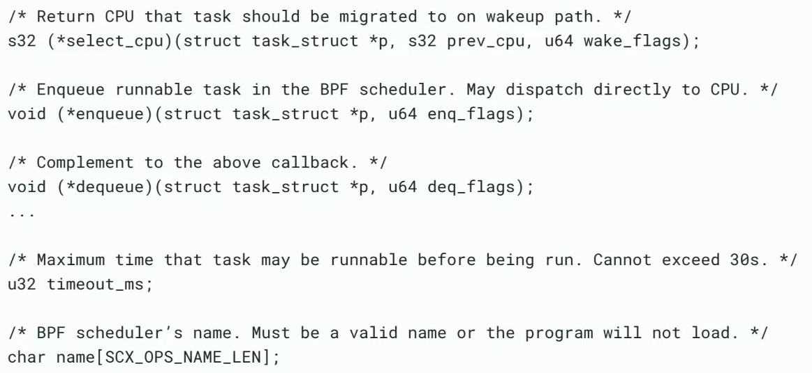
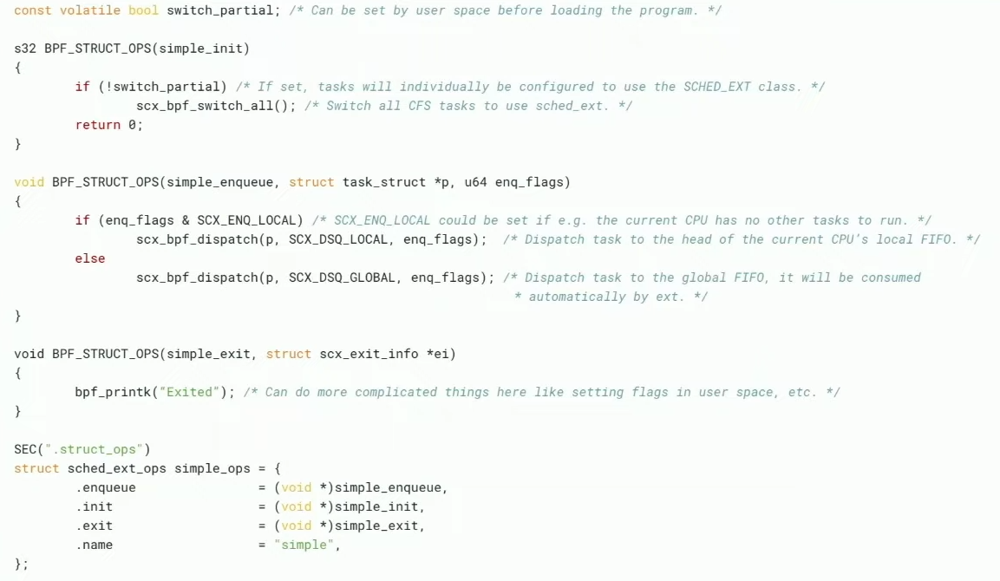
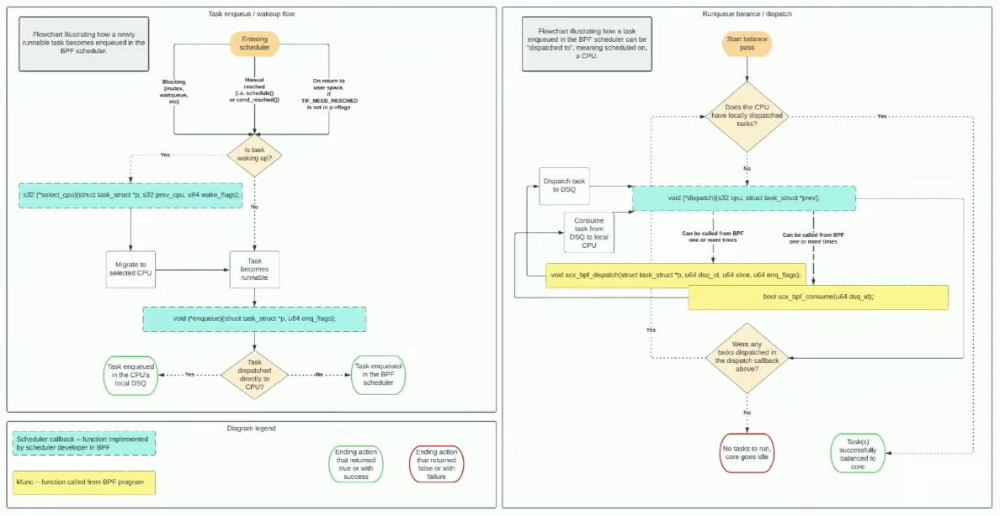

= David Vernet (The Linux Foundation)
sched ext | David Vernet (The Linux Foundation)

Summary of video (https://www.youtube.com/watch?app=desktop&v=MXejs4KGAro[Link to Video])

== Introduction
David Vernet works at meta. He has been working for Meta on sched_ext, for the past year and half (in date june 2023). sched_ext enable scheduling policies to be implemented in BPF programs. Its main advantages are:

. *Rapid experimentation* needed for [.underline]#new and diverse hardware and software#
.. *Simple* and intutitive API
.. *Safe*, cannot crash host (afforded by [.underline]#BPF verifier# and by [.underline]#watchdog that boots scheduler# if it hasn't scheduled some runnable task after some time)
. Allows creating scheduler *optimized for specific services* ([.underline]#bespoke schedulers#)
.. at meta allowed to optimize FB web service by *1.25-3% RPS, 3-6% P99 latencty*.
. *Quick rollouts* of new policies (es. temporary workaround before full mitigation)
. Allows moving policy decision to *user space*

== How to implement new scheduling policies
The BPF program must:

. Implements a set of callbacks
.. Task wakeup
.. Task enqueue/dequeue
.. Task state change (runnable, running, stopping, quiescent)
.. CPU need task(s) (balance)
.. Cgroup integration
.. ...
. provide fields which globally configure scheduler
.. *max number of tasks* that can be dispatched
.. *timeout* in ms (not exceeding 30s)
.. *name* of scheduler

It is actually not require to implement any of the methods because each of them have a *default implementation*.

== Examples
.Examples of methods to implements
[%collapsible]  
==== 

====

.Examples of partial implementation
[%collapsible]  
==== 

====

== Code path
See video.

== Common objections (less important)
. will *kill CFS contribuitions*, staying out of tree and non-GPL
.. verifier [.underline]#check that is GPL#
. *difficult for distro* to support 
.. possibly [.underline]#need to taint# the kernel
. will *force UAPI* onto the scheduler 

== Change to BPF needed for sched ext (less important)
. *bpf_cpumask* is a wrapper around the internal cpumask_t (comparable with cpumask_t directly) 
. use [.underline]#RCU context# instead of *kptr_get*

== Notes
Rewatch part of example and code path (5-10 minutes mark)
